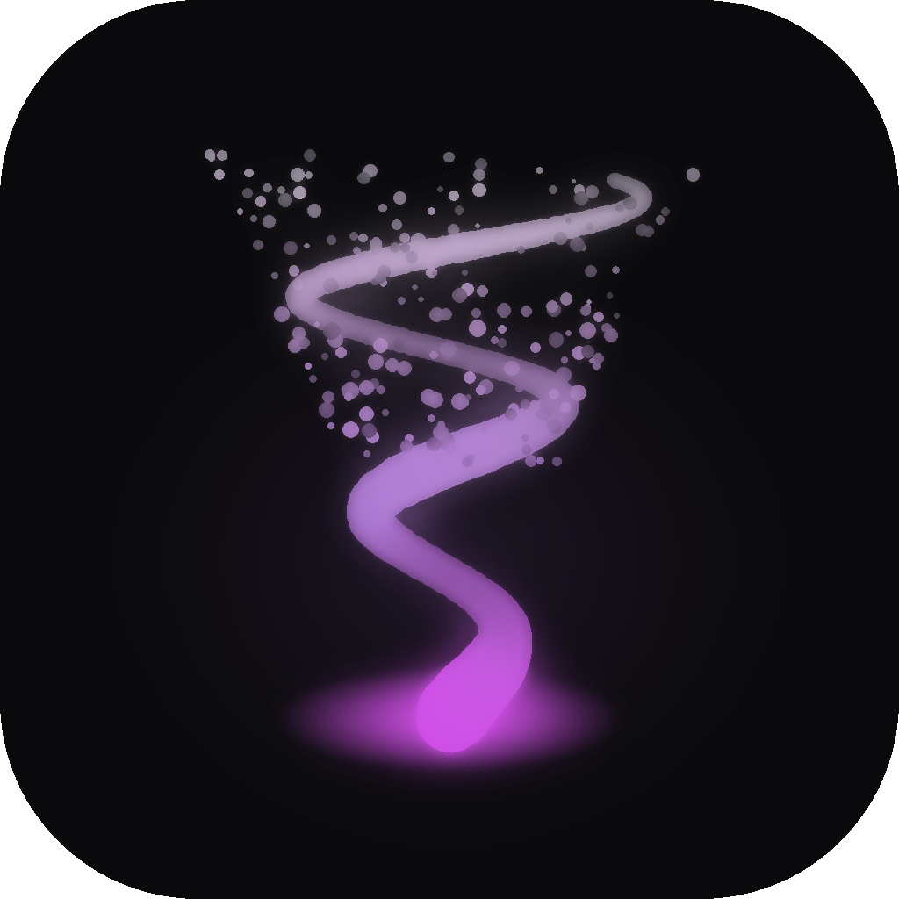

<div align="center">



# Vesper Launcher

**A Minecraft: Java Edition launcher with its own client mod, a built-in server manager, and a theme system that actually recolours everything.**

*Mauve on black by default. Every colour is yours to change.*

[](../../actions/workflows/build.yml)
[](../../releases)
[](LICENSE)
[](https://dotnet.microsoft.com)
[](../../releases)

</div>

---

## What this is

Vesper is a desktop launcher for **Minecraft: Java Edition**. It downloads and runs any version Mojang
has ever published, installs mod loaders for you, and keeps every instance isolated so your worlds and
mods never collide.

It goes further than a plain launcher in three ways:

- **Vesper Loader** is our own curated profile, built on Fabric or Forge, that ships a client mod we
  write ourselves. Motion blur, a configurable HUD, cosmetics, and a performance bundle, all in one click.
- **Servers** are first-class. Spin up a Paper or Purpur server, watch its console, manage plugins, and
  expose it to friends over a playit.gg tunnel without touching your router.
- **Themes** are data, not code. Every brush in the app binds to a token, so a theme file recolours the
  entire interface at runtime with no restart.

Nothing is written to your `.minecraft` folder. Vesper keeps its own directory.

---

## Features

| | Feature | Notes |
|---|---|---|
| **Versions** | Every Mojang release | Releases, snapshots, betas, alphas, all the way back |
| **Loaders** | Fabric, Forge, NeoForge, Quilt | Pick the loader *and* the loader version, not just latest |
| **OptiFine** | Manual import | Its licence forbids redistribution, so you supply the jar and Vesper runs the installer |
| **Vesper Loader** | Fabric or Forge, 1.21+ | Our mod plus a curated performance bundle, installed in one click |
| **Accounts** | Microsoft and local | Local accounts need no Microsoft account and have no restrictions |
| **Skins** | Change skins for both | Real API calls for Microsoft accounts, mod-driven rendering for local ones |
| **Servers** | Paper and Purpur | Start, stop, restart, live console, plugins, playit.gg tunnel |
| **Java** | Managed automatically | The right JRE per version, downloaded for you. Java 8 for old versions, 21 for modern |
| **Mods** | Modrinth and CurseForge | Browse and install in-app, or drop jars in the folder and rescan for metadata |
| **Skins** | 3D editor built in | Rotate the model, paint pixels directly onto it, upload a PNG, save per account |
| **Isolation** | Per-profile game directories | Shared libraries and assets, so twenty profiles do not mean twenty copies |
| **Themes** | Fully tokenised | Change any colour in the app, live |

---

## Accounts

Vesper supports two account types, and **either one can be created first on a fresh install.**

**Local accounts** ask for a username and nothing else. No password, no validation, no Microsoft account
required, no restrictions on the name. They use the standard offline UUID derivation
(`OfflinePlayer:<name>` hashed to a version-3 UUID), which is byte-for-byte identical to what the game
itself computes, so worlds and server permissions stay stable across launches.

**Microsoft accounts** sign in through the device code flow. Vesper shows you a short code and a URL,
you approve it in a browser, and that is it. No embedded browser window, which is the part that
usually breaks. Refresh tokens are encrypted at rest with DPAPI on Windows.

### An honest note about offline skins

Skin rendering happens on **each viewer's machine**. Vesper can make your client render skins and capes
for local accounts, including resolving other players' real skins by username on offline servers. What
it cannot do is make a *vanilla* client render *your* custom skin, because that client never asked us.

So: your custom skin is visible to you and to anyone else running the Vesper mod. It is not visible to
players on unmodified clients. No launcher can change that, and any that claims otherwise is not being
straight with you.

---

## Install

Grab the latest build from [Releases](../../releases).

| Platform | File | Notes |
|---|---|---|
| Windows | `VesperLauncher-<version>-Setup.exe` | Installer. Per-user, so no admin prompt |
| macOS (Apple Silicon) | `...-osx-arm64.dmg` | See the Gatekeeper note below |
| macOS (Intel) | `...-osx-x64.dmg` | See the Gatekeeper note below |

The Windows installer puts Vesper in `%LOCALAPPDATA%\Programs\VesperLauncher`, adds Start menu and
desktop shortcuts, and registers an entry in Add or remove programs. Because it installs per-user it
never asks for administrator rights. Uninstalling offers to keep or delete your profiles, worlds and
downloaded game files, and keeps them by default.

**macOS builds are unsigned.** Notarisation requires a paid Apple Developer account. Until that is in
place, right-click the app and choose *Open* the first time, or run:

```bash
xattr -dr com.apple.quarantine "/Applications/Vesper Launcher.app"
```

---

## Build from source

You need the **.NET 10 SDK**. For the mod, you also need **JDK 21**.

```bash
git clone https://github.com/AroseEditor/Vesper-Launcher.git
cd vesper-launcher

dotnet restore
dotnet build
dotnet test

dotnet run --project src/Vesper.App
```

To produce a self-contained binary for your platform:

```bash
dotnet publish src/Vesper.App -c Release -r win-x64 \
  --self-contained true -p:PublishSingleFile=true -o publish
```

Swap `win-x64` for `osx-arm64` or `osx-x64` as needed.

Linux is not built for releases. The code is cross-platform and CI still compiles and tests on Linux,
so `-r linux-x64` will work if you publish it yourself, but no Linux artifact ships.

### Building the Windows installer

Needs [NSIS](https://nsis.sourceforge.io) on the path. Publish to a folder first, then run makensis:

```bash
dotnet publish src/Vesper.App -c Release -r win-x64 \
  --self-contained true -p:PublishSingleFile=false -o publish/win-x64

mkdir -p artifacts
cd installer

makensis /DAPP_VERSION=0.1.0 /DVI_VERSION=0.1.0.0 \
  /DSOURCE_DIR=..\publish\win-x64 \
  /DOUT_FILE=..\artifacts\VesperLauncher-0.1.0-Setup.exe \
  vesper.nsi
```

The installer must be built from a folder publish, not a single-file one.

### Building the mod

The mod is a separate Gradle project under `mod/`. It needs **JDK 21** and **Gradle 8.10 or newer**.
No Gradle wrapper is committed, so either use a system Gradle:

```bash
cd mod
gradle build
```

or generate a wrapper once and use that afterwards:

```bash
cd mod
gradle wrapper
./gradlew build
```

The first build downloads and decompiles Minecraft through Architectury Loom, so expect it to take
several minutes. **This build is not yet verified** - see the roadmap. CI attempts it on release but
is configured not to block a launcher release if it fails.

### Regenerating the icon

```bash
python brand/generate_icon.py
```

This draws the icon procedurally and writes `icon.png`, `icon-wordmark.png`, `icon.ico`, and every
size under `brand/generated/`. To use your own artwork instead:

```bash
python brand/generate_icon.py --source path/to/your-art.png
```

---

## How it is put together

```
src/
  Vesper.Core/        Launcher logic with no UI. Paths, profiles, accounts, auth, loaders,
                      mods, servers, skins, themes, versions, launching
  Vesper.App/         Avalonia UI. Views, viewmodels, theme application, icons, 3D skin control
  Vesper.Core.Tests/  Unit tests
mod/                  Gradle multiloader project for the Vesper client mod
  common/             Shared logic: motion blur, HUD layout, config, skin resolution
  fabric/ forge/      Loader entrypoints
brand/                Icon source and generator
scripts/              Convention checks used by CI
```

The 3D skin viewer is a software rasteriser written from scratch in `Vesper.Core/Skins`. It has a
z-buffer, per-face shading and a pick buffer, which is what lets you paint pixels directly onto the
rotating model rather than only onto a flat texture.

The mod's motion blur is frame-accumulation, the same approach Lunar and Badlion use, not an
Iris or OptiFine shaderpack. Its blend factor is frametime-normalised, so the effect has an identical
half-life at 60, 120 and 240 frames per second.

The launcher is **C# on .NET 10** with **Avalonia 12** for the interface, and leans on
[CmlLib.Core](https://github.com/CmlLib/CmlLib.Core) for the genuinely hard parts of launching
Minecraft: version manifest resolution, library rule evaluation, native extraction, asset indexing,
and classpath construction.

Microsoft authentication is implemented directly against Microsoft's endpoints rather than through
MSAL, which keeps it working identically on all three platforms and makes a custom client ID a
one-line setting.

### Where your files go

Vesper stores everything under `%LOCALAPPDATA%\VesperLauncher` on Windows, or the platform equivalent
elsewhere. Drop a `portable.txt` next to the executable and it will use a `VesperData` folder beside
itself instead.

```
vesper.json            Global settings
accounts.json          Accounts. Microsoft refresh tokens encrypted at rest
themes/                Your theme files
runtime/               Managed Java runtimes
shared/                Assets, libraries and version manifests, shared across instances
instances/<id>/
  instance.json        Version, loader, RAM, Java, mods
  .minecraft/          Isolated game directory. Saves, mods, config, resource packs
servers/<id>/          Paper or Purpur server, world, plugins
```

Shared libraries with isolated game directories is the model Prism uses, and it is why adding your
twentieth instance costs almost no disk space.

---

## Theming

A theme is a JSON file of colour tokens. Every brush in every view binds to one of these, which is what
makes "change all the colours" actually work rather than leaving stragglers behind.

| Token | Default | Used for |
|---|---|---|
| `bgBase` | `#0A0A0C` | Window background |
| `bgElevated` | `#121216` | Title bar, sidebar |
| `bgCard` | `#1A1A20` | Cards, popovers |
| `bgHover` | `#23232B` | Hover states |
| `borderSubtle` | `#26262F` | Dividers, card edges |
| `borderStrong` | `#3A3A47` | Popover edges |
| `accent` | `#B57EDC` | Primary actions, active nav |
| `accentHover` | `#C9A0DC` | Accent hover |
| `accentDeep` | `#9A5FC4` | Avatars, depth |
| `accentBreath` | `#D14FE8` | Dragon breath highlight, glow |
| `accentContrast` | `#12060F` | Text on accent |
| `textPrimary` | `#F2EEF6` | Body text |
| `textMuted` | `#A9A2B5` | Secondary text |
| `textFaint` | `#6E6880` | Labels, metadata |
| `success` `warning` `danger` | | Status colours |

To make your own, copy a built-in theme, change what you like, and drop it in `themes/`:

```json
{
  "name": "My Theme",
  "colors": {
    "bgBase": "#08080A",
    "accent": "#7EDCC4",
    "accentBreath": "#4FE8C8"
  }
}
```

Any token you leave out falls back to the Mauve Black default, so a three-line theme is perfectly valid.

---

## Roadmap

- [x] Core launch pipeline with isolated profiles and shared assets
- [x] Local and Microsoft accounts
- [x] Theme system and animated application shell
- [x] Cross-platform CI with drafted releases
- [x] Loader installers for Fabric, Quilt, Forge, NeoForge and OptiFine import
- [x] Version browser with per-profile loader and loader-version selection
- [x] Mods manager with Modrinth and CurseForge browsing
- [x] Skins page with a 3D model editor
- [x] Servers tab with Paper install, live console and a full server.properties editor
- [ ] playit.gg tunnel management
- [ ] Vesper mod wired into the game: motion blur pass, HUD rendering, offline skin injection
- [ ] Vesper Loader one-click profiles

---

## Contributing

Two conventions are enforced by CI and are not negotiable:

- **No comments in source files.** Names and structure carry the meaning.
- **No emoji** anywhere, including this README and commit messages.

Run the checker before pushing:

```bash
python scripts/check_conventions.py
```

---

## License

**Source-available, not MIT.** See [LICENSE](LICENSE).

You may use, study, modify and redistribute Vesper, including commercially. What you may not do is
strip the attribution, rebrand it, and pass it off as your own work. Forks must keep the licence and
the credit to **ayush.ue5**, must say clearly that they are modified, and must use their own name and
logo rather than Vesper's.

*Vesper Launcher is not affiliated with, endorsed by, or associated with Mojang Studios or Microsoft.
Minecraft is a trademark of Mojang Studios. Vesper downloads game files from Mojang at runtime and
redistributes nothing.*
